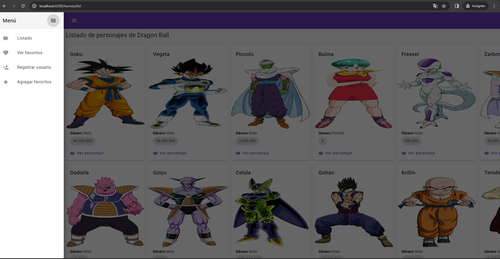

# Guía para Levantar Aplicación Spring Boot y Angular

Esta guía proporciona instrucciones detalladas sobre cómo levantar una aplicación Spring Boot y una aplicación Angular por separado.

## Levantar Aplicación Spring Boot

Para levantar la aplicación Spring Boot, sigue estos pasos:

1. Asegúrate de tener instalado Java Development Kit (JDK) en tu sistema. Puedes descargarlo desde [Java SE Downloads](https://www.oracle.com/java/technologies/javase-jdk11-downloads.html).

2. Crear base de datos sobre un motor postgresql

   ```bash
   nombre de dase de datos: dragonball
   usuario propietario de base de datos: cde-msa-dragon-ball
   contraseña propietario de base de datos: 12345678

3. Clona el repositorio de la aplicación Spring Boot:

   ```bash
   git clone https://github.com/krismaggot1991/dragon-ball-api.git

4. Navega al directorio raíz de la aplicación Spring Boot:

   ```bash
   cd cde-msa-sp-dragon-ball

5. Compila y ejecuta la aplicación 

   ```bash
   La aplicacion se levantará sin problemas, solo requiere que se haya creado la base de datos 

6. La aplicación estará disponible en

   ```bash
   http://localhost:8080

7. Archivo swagger con la documentacion de los enpoints expuestos

   ```bash
   https://github.com/krismaggot1991/dragon-ball-api/blob/main/cde-msa-sp-dragon-ball/src/main/resources/openapi.yaml

## Levantar Aplicación Angular

Para levantar la aplicación Angular, sigue estos pasos:

1. Asegúrate de tener instalado Node.js (version 20.11.1 o superior) y npm en tu sistema. Puedes descargarlos desde Node.js Downloads.

2. Clona el repositorio de la aplicación Spring Boot:

   ```bash
   git clone https://github.com/krismaggot1991/dragon-ball-api.git

4. Navega al directorio raíz de la aplicación Spring Boot:

   ```bash
   cd cde-spa-sp-dragon-ball

5. Compila y ejecuta la aplicación 

   ```bash
   npm install
   ng serve

6. La aplicación estará disponible en

   ```bash
   http://localhost:4200/heroes/list


## Captura de pantalla

